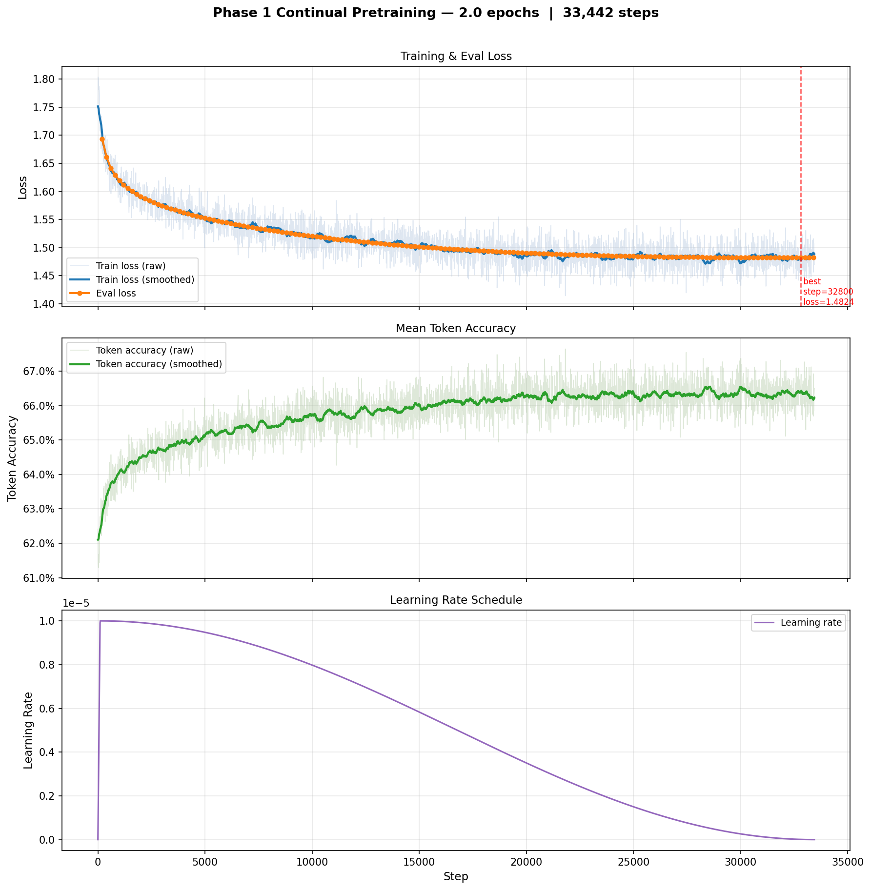

# teleSLMs PEFT Pilot

LoRA proof-of-concept for domain-adapting `Qwen2.5-1.5B` to 3GPP telecommunications standards. Ran before committing to the full pipeline — the main codebase that benchmarks different SLMs with full fine-tuning is at [teleSLMs_fft](https://github.com/NareshModina/tele-SLMs).

---

## What this is

A two-phase pilot to validate the data pipeline and confirm that continual pretraining on telecom standards meaningfully shifts the model distribution before scaling to full fine-tuning across a model size ladder.

---

## Files

```
tokenize_dataset.py   Pre-tokenize and pack Tele-Data into 2048-token blocks
pretrain.py           Phase 1 — LoRA continual pretraining on telecom corpus
merge_adapter.py      Merge LoRA adapter into base model weights
sft.py                Phase 2 — LoRA instruction fine-tuning on Alpaca
evaluate.py           Tele-Eval benchmark evaluation
explore.ipynb         Dataset exploration and sanity checks
```

---

## Config

| Setting | Value |
|---|---|
| Base model | Qwen/Qwen2.5-1.5B |
| Fine-tuning | LoRA (r=64, α=128, dropout=0.05) |
| Target modules | q/k/v/o_proj, gate/up/down_proj |
| Trainable params | ~1.3% of total |
| Sequence length | 2048 (pre-packed, no padding waste) |
| Batch size | 4 per device × 4 grad accum steps |
| Learning rate | 1e-5 (cosine, 100 warmup steps) |
| Epochs | 2 |
| Hardware | 3× NVIDIA L40S (45GB), PyTorch DDP |
| Attention | Flash Attention 2 / SDPA fallback |

---

## Dataset

Training from [Tele-Data (Maatouk et al., 2024)](https://huggingface.co/datasets/AliMaatouk/Tele-Data):

| Source | Documents | Tokens |
|---|---|---|
| 3GPP Standards (×8 upsample) | 2,801 | ~688M |
| arXiv papers | 90,310 | ~1.08B |

Standards split on clause boundaries (`X.X.X\tTitle`) before upsampling. Total after packing: ~**1.26B tokens/epoch**.

Evaluation: [Tele-Eval](https://huggingface.co/datasets/AliMaatouk/Tele-Eval) — held out, never seen during training.

---

## Results

**Phase 1 — Continual Pretraining** (33,442 steps, 2 epochs, ~131h on 3× L40S)

| Metric | Start → End |
|---|---|
| Train loss | 1.76 → 1.48 |
| Eval loss | — → 1.48 |
| Token accuracy | 62.4% → 66.3% |



**Phase 2 — Instruction Fine-Tuning** (Alpaca, 52k examples, 2,124 steps, ~34min on 3× L40S)

| Metric | Start → End |
|---|---|
| Train loss | 1.59 → 1.33 |
| Eval loss | — → 1.30 |

**Tele-Eval Benchmark** (2,000 examples, seed 42):

| Model | Token F1 | Perplexity |
|---|---|---|
| Qwen2.5-1.5B base | 31.20% | 8.90 |
| Qwen2.5-1.5B LoRA pretrain + SFT | 30.08% | 8.35 |

The perplexity improvement (+6%) confirms Phase 1 pretraining shifted the model distribution toward telecom standards. The slight F1 regression is a format mismatch — Alpaca-style SFT produces verbose outputs that overlap poorly with the terse gold answers in Tele-Eval — not a loss of domain knowledge.

---

## What the pilot told us

LoRA has two limitations for this task:

1. **Capacity** — the corpus is too large to fully absorb with a low-rank adapter; full fine-tuning is needed to update all weights with the domain signal.
2. **SFT data** — Alpaca alone is too small and too generic for a technical domain.

[teleSLMs_fft](https://github.com/NareshModina/tele-SLMs) addresses both: full fine-tuning on a larger TeleSpec-Data corpus (3GPP + ETSI, 38,302 documents) across a model size ladder (SmolLM2-135M → 360M → 1.7B).

---

## Quick Start

```bash
pip install torch transformers datasets peft trl accelerate

# 1. Tokenize and pack
python tokenize_dataset.py \
    --model   Qwen/Qwen2.5-1.5B \
    --dataset ./tele-preprocessed \
    --output  ./tele-tokenized

# 2. Smoke test (10 steps)
python pretrain.py --smoke-test

# 3. Full pretraining
python pretrain.py

# 4. Merge Phase 1 adapter
python merge_adapter.py \
    --base-model Qwen/Qwen2.5-1.5B \
    --adapter    ./checkpoints/stage1-lora \
    --output     ./checkpoints/stage1-merged

# 5. Instruction fine-tuning
python sft.py

# 6. Merge Phase 2 adapter
python merge_adapter.py \
    --base-model ./checkpoints/stage1-merged \
    --adapter    ./checkpoints/stage2-lora \
    --output     ./checkpoints/stage2-merged

# 7. Evaluate
python evaluate.py --checkpoint ./checkpoints/stage2-merged
```

---

## Citation

```bibtex
@misc{maatouk2024telellms,
    title         = {Tele-LLMs: A Series of Specialized Large Language Models for Telecommunications},
    author        = {Ali Maatouk and Kenny Chirino Ampudia and Rex Ying and Leandros Tassiulas},
    year          = {2024},
    eprint        = {2409.05314},
    archivePrefix = {arXiv},
    primaryClass  = {cs.IT}
}
```